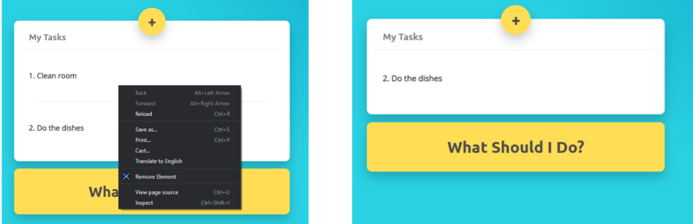

# Remove-Element Chrome Extension

This extension was made due to my frustration of not being able to find a simple extension that simply deletes any element on a page.
From the basic div, to even the options on an iframe (Meaning any video player), this extention obliterates them all by right clicking and pressing remove element.

This works as well with any ads on a page, simply right click and banish them.

##### Example with an iframe

##### Example on an ad

##### Twitch chat has a lot more to give

##### Straight up life hacks

##### If you enjoy this feel free to send me a tip it is always appreciated :)

[Tip Jar](paypal.me/paymoishi)
